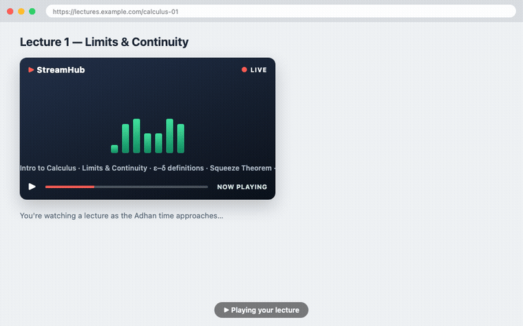

# Adhan Caster Pro — Chrome Extension

Upcoming Islamic prayer times with a live countdown, and **automatic pausing of
media in every Chrome tab** at Adhan time — with an optional full-screen "prayer
focus" screen.

It's a standalone Chrome extension. It fetches prayer times from the public
[adhan-api](https://github.com/bilalahamad0/adhan-api) service
(`adhan-api-mauve.vercel.app`) and resolves locations via the free
[Open-Meteo](https://open-meteo.com/) geocoding API.

**[Install from the Chrome Web Store →](https://chromewebstore.google.com/detail/jfjknglldcdminelckmmfdbnlikiogia?utm_source=readme)** &nbsp;·&nbsp; **[🌐 Website &amp; FAQ](https://adhan.bilalahamad.com/)**



## Features

- **Next-prayer popup** — all five daily prayers with the next one highlighted and a live countdown.
- **In-page heads-up countdown** — a card pinned to the bottom-right of whatever tab you're looking at, appearing before the prayer (default **30s**, configurable 15/30/60). No Resume button here, so it never competes with the focus screen.
- **Auto-pause across tabs** — at the exact prayer time, every playing `<video>`/`<audio>` (including same-/cross-origin iframes) is paused.
- **Resume** — one **Resume** button (popup or the in-page card) restores the paused tabs, and playback **auto-resumes** after a configurable delay (default 5 min). Both overlays show a live "Auto-resumes in M:SS" countdown.
- **Prayer focus mode** (opt-in) — a full-screen, dismissible focus screen across tabs during the Adhan. Enable by default in settings, or trigger per-event from the notification's **Prayer focus** button, the popup, or `Ctrl/Cmd+Shift+Y`. Exit with **Resume** or **Esc**.
- **Desktop notification** at prayer time, with **Prayer focus** / **Resume now** action buttons.
- **Location picker** — one search box backed by Open-Meteo geocoding. Type a city and pick a real place; it resolves the region/province + country and stores coordinates. You can't save a location that isn't a real geocoded place.

## Setup (for development)

```bash
npm install      # installs Jest (dev only — the extension itself has no runtime deps)
npm test         # unit + manifest qualification tests
npm run pack     # runs the tests, then zips a clean build → adhan-caster-pro-<version>.zip
```

To publish a new version to the Chrome Web Store, see [RELEASING.md](RELEASING.md).

## Load it (unpacked)

1. Open `chrome://extensions` in Chrome.
2. Toggle **Developer mode** on (top-right).
3. Click **Load unpacked** and select **this repo folder**.
4. Pin the extension, click its icon, open **⚙ settings**, search your city, then **Save**.

> First load asks for broad site access ("read and change all your data on all websites").
> That permission is what lets the extension reach into any tab to pause media — the core feature.

## Dev demo — see it without waiting for a prayer

1. Open a tab playing media (e.g. a YouTube video) and start it.
2. Extension icon → **⚙ settings** → **Run test Adhan (30s)**. _(Shown only in unpacked/dev builds; hidden in the published version.)_
3. Switch to the media tab. A countdown ticks down; at zero the media **pauses**, the desktop notification fires, and (if focus mode is on, or you press **Prayer focus**) the **focus screen** takes over. It auto-resumes after your delay, or press **Resume** / **Esc**.

It's ~30s because `chrome.alarms` clamps shorter delays. The OS must allow notifications for Chrome for the desktop banner. Regenerate the demo GIF with `npm run demo` and the store screenshots with `npm run shots`.

## How it works

For an interactive, animated tour — the component map, the message/data flow,
and the full Adhan event lifecycle step by step — open
**[docs/architecture.html](docs/architecture.html)** in a browser. The table
below is the same architecture in words.

| Piece | Responsibility |
| :--- | :--- |
| `background.js` (module service worker) | Fetches the schedule, parses prayer times into timestamps, arms `chrome.alarms`, fires the desktop notification + broadcasts the cross-tab pause, and arms auto-resume. |
| `content.js` (all frames) | Per-second ticker: bottom-right countdown overlay + full-screen focus overlay (top visible frame, Shadow DOM), and pauses/resumes its own frame's media. |
| `popup.html/js/css` | Prayer list, live countdown, Resume, the Open-Meteo location search, and settings. |
| `lib/schedule.js`, `lib/geocode.js` | Pure, dependency-free helpers (time parsing / next-prayer / formatting; geocoding) — unit-tested. |
| `icons/generate-icons.cjs` | Regenerates the PNG icons with pure Node `zlib` (`npm run icons`). |

See [docs/TESTING.md](docs/TESTING.md) for the full pre-publish QA checklist.

### Notes & assumptions

- Prayer times come back as `"hh:mm a"` strings and are parsed in the **browser's local timezone**, which is correct when your machine's timezone matches the chosen location.
- `chrome.alarms` isn't second-accurate when the service worker is asleep, so `content.js` self-triggers the pause when its own countdown hits zero. Both paths are idempotent.
- Restricted pages (`chrome://`, the Web Store, the PDF viewer) can't host content scripts, so media there isn't paused — a Chrome platform limitation.

## Marketing, reach & store listing

Assets for getting the extension in front of more people:

- **[docs/index.html](https://adhan.bilalahamad.com/)** — public landing page (SEO-optimized, served via Vercel at `adhan.bilalahamad.com`).
- **[docs/store-listing.md](docs/store-listing.md)** — copy/paste source of truth for the Chrome Web Store Developer Dashboard: keyword-optimized title, summary, description, permission justifications, and screenshot captions.
- **[docs/launch-kit.md](docs/launch-kit.md)** — ready-to-post launch copy (Reddit, Show HN, Product Hunt, Facebook, X), the channel/subreddit plan, review-collection tips, and Ramadan timing.
